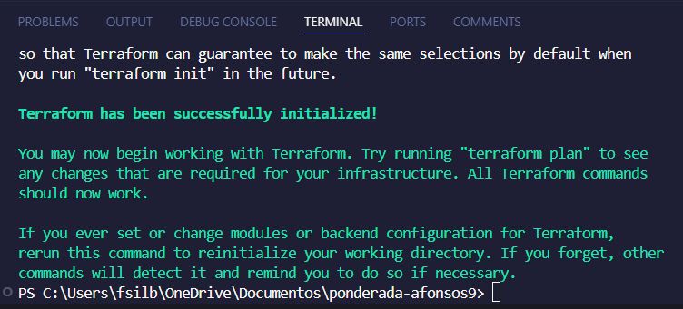
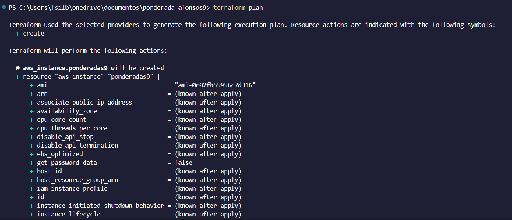
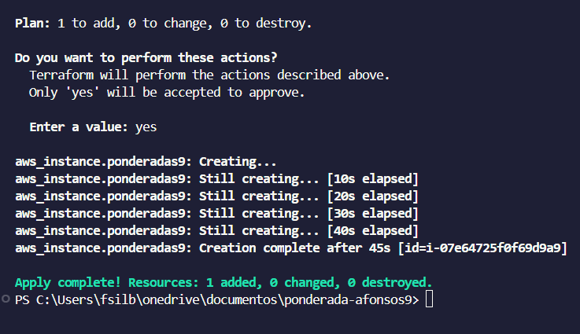
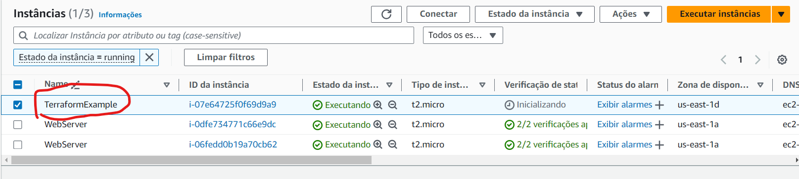

# Ponderada Semana 9 - IaC com terraform

Este documento possui como objetivo apresentar um passo a passo de execução da criação de uma instância EC2 utilizando terraform.

**Passo 1: Instalar o Terraform CLI**

Execute os comandos a seguir em um Powershell como administrador para instalar corretamente o Terraform CLI

```
Invoke-WebRequest -Uri https://releases.hashicorp.com/terraform/1.0.11/terraform_1.0.11_windows_amd64.zip -OutFile terraform.zip
```
```
Expand-Archive -Path terraform.zip -DestinationPath C:\terraform
```

```
[System.Environment]::SetEnvironmentVariable('PATH', $env:PATH + ';C:\terraform', [System.EnvironmentVariableTarget]::Machine)
```

**Passo 2: Baixar a AWS CLI e configurar as credenciais do usuário**

Em um Powershell como administrador, executar os comandos a seguir:

```
Invoke-WebRequest -Uri https://awscli.amazonaws.com/AWSCLIV2.msi -OutFile AWSCLIV2.msi
```
<br>

```
Start-Process msiexec.exe -Wait -ArgumentList '/I AWSCLIV2.msi /quiet'
```
<br>

```
aws configure
```

Inserir as credenciais ```aws_access_key_id```, ```aws_secret_access_key``` e ```aws_session_token```

<br><br>

```
cd ~\.aws\
```

<br>

```
notepad credentials
```
Adicionar no arquivo uma seção com suas credenciais como o exemplo abaixo.

<br>

```
[default]
aws_access_key_id = YOUR_ACCESS_KEY_ID
aws_secret_access_key = YOUR_SECRET_ACCESS_KEY
aws_session_token = YOUR_SESSION_TOKEN
```

**Passo 3: Criar arquivo ```main.tf```**

Criar arquivo com nome ```main.tf``` na pasta raiz do repositório com o conteúdo a seguir:

```
provider "aws" {
  region = "us-east-1"
}

resource "aws_instance" "ponderadas9" {
  ami           = "ami-0c02fb55956c7d316"  # Amazon Linux 2 AMI (HVM), SSD Volume Type
  instance_type = "t2.micro"

  tags = {
    Name = "TerraformExample"
  }
}
```

**Passo 4:  Iniciar o diretório contendo arquivos de configuração do Terraform, baixando os plugins necessários e preparando o ambiente.**

Na pasta onde o arquivo ```main.tf``` foi adicionado, executar o comando a seguir no terminal:

```
terraform init
```



**Passo 5: Criar um plano de execução mostrando as mudanças que serão realizadas na infraestrutura sem aplicá-las de fato, permitindo revisão e validação.**

Para criar esse plano de execução, basta rodar no mesmo diretório da etapa anterior o comando a seguir no terminal:

```
terraform plan
```



**Passo 6: Aplicar as alterações e criar, de fato, o serviço na AWS**

Para isso, é preciso executar o seguinte comando no terminal:

```
terraform apply
```



**Passo 7: Verificar se a instância foi devidamente criada no AWS Console**

